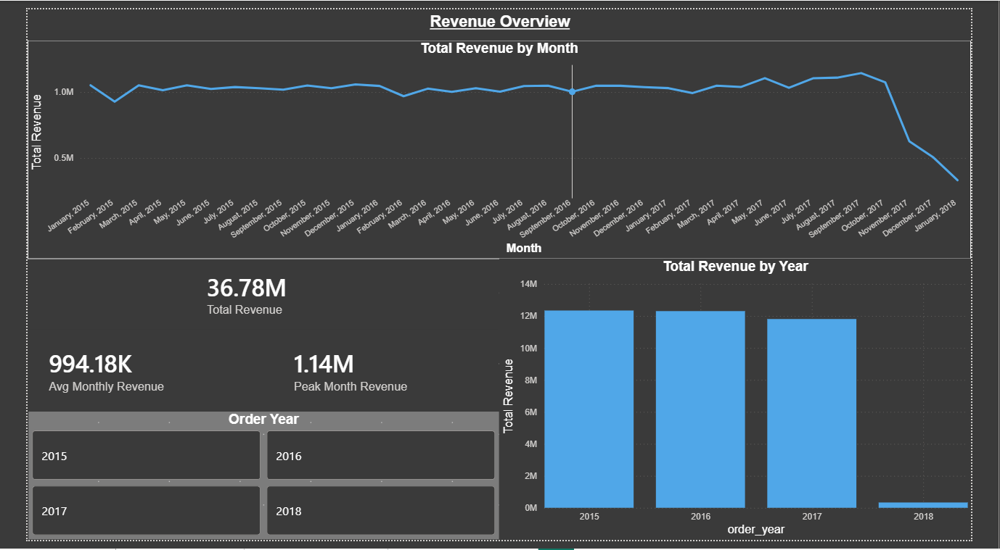
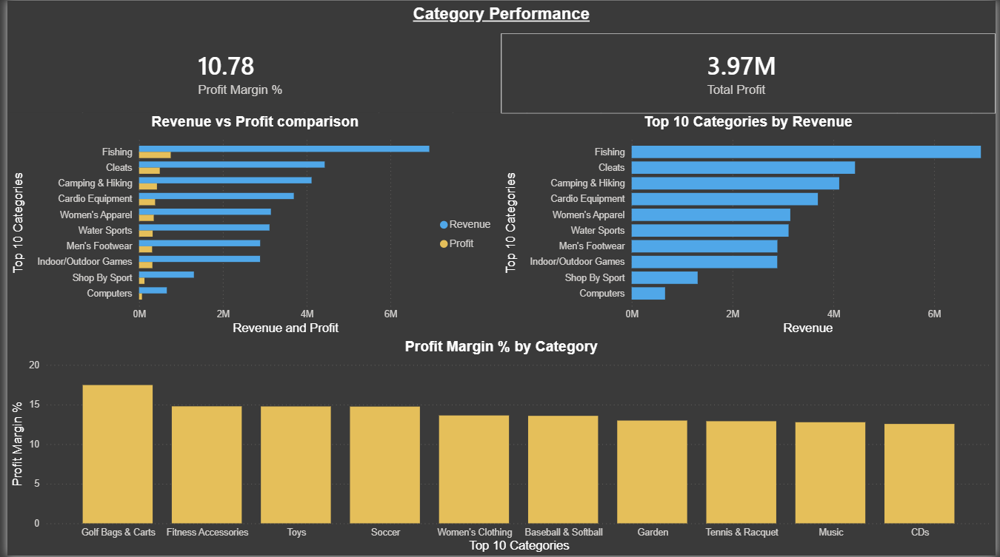
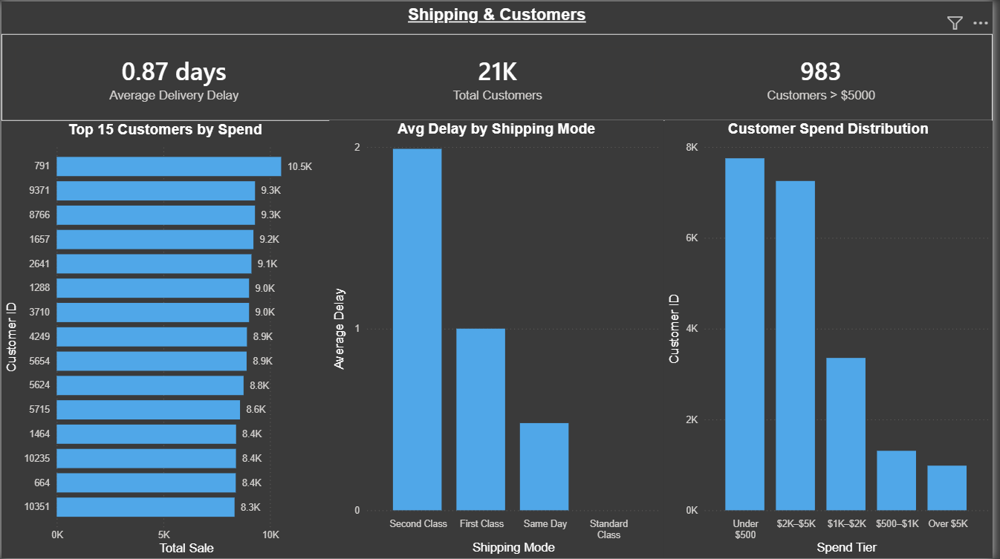

# DataCo Supply Chain Data Pipeline

> An end-to-end Medallion Architecture pipeline (Bronze → Silver → Gold) built with PySpark & Delta Lake, feeding a 3-page Power BI executive dashboard.


---

## Overview

This project implements a full end-to-end data engineering pipeline on the **DataCo Smart Supply Chain** dataset (**180K+ transaction records**) from Kaggle. Raw transactional data is processed through three structured layers — **Bronze**, **Silver**, and **Gold** — following the **Medallion Architecture** pattern. The Gold layer outputs feed a 3-page Power BI executive dashboard built for direct business consumption.

The pipeline runs on **Apache Spark (PySpark) with Delta Lake**, orchestrated in a Google Colab notebook environment.

---

## Key Findings

The dashboard surfaced several operational insights that standard reporting would miss:

### 🚚 Shipping reliability is a process failure, not a one-off
**First Class shipping is late on 100% of orders** — every single First Class shipment missed its scheduled delivery date. Looking at *average* delay by mode tells a complementary story: **Second Class carries the worst average delay (~2 days)**, First Class ~1 day, while **Standard Class is effectively on time (~0 days)**. The distinction matters: *late-delivery rate* (how often) and *average delay* (how badly) are different lenses, and together they point to a systemic scheduling problem in the expedited modes rather than random variance.

### 💰 The biggest revenue category is not the most profitable
Overall profit margin sits at **10.78%** on **$3.97M total profit**. **Fishing dominates revenue (~$6.5M)**, far ahead of Cleats and Camping & Hiking — yet the **highest-margin categories are entirely different**: Golf Bags & Carts (~17.5%), Fitness Accessories, Toys, and Soccer (~14–15%) all beat the company average, while the revenue leaders cluster near it. This revenue-vs-margin divergence is a direct pricing and product-mix opportunity.

### 📉 The 2018 "revenue cliff" is a data-coverage artifact — not a collapse
Revenue held steady at **~$12M/year across 2015–2017** (**$36.78M total, $994.18K average per month**). The sharp drop in 2018 reflects the dataset ending in early 2018 — i.e. a partial year — **not** an actual revenue collapse. Flagged explicitly so the trend isn't misread by stakeholders.

### 👥 Customer spend is concentrated in the lower tiers
Across **21K customers**, only **983 spend more than $5,000**. The spend distribution is bottom-heavy (the *Under $500* and *$2K–$5K* tiers dominate), which has direct implications for retention and high-value-account strategy.

---

## Dashboard

### Page 1 — Revenue Overview
*How did revenue trend over time, and which years performed best?*



### Page 2 — Category Performance
*Which categories drive revenue and profit, and where are the margins?*



### Page 3 — Shipping & Customers
*Are shipments on time, and how is customer spend distributed?*



---

## Dataset

The dataset is too large to host on GitHub. Download it from Kaggle before running the notebook:

**Download:** [DataCo Smart Supply Chain Dataset on Kaggle](https://www.kaggle.com/code/kerneler/starter-dataco-smart-supply-chain-for-407715b4-c/input)

After downloading, place `DataCoSupplyChainDataset.csv` in the same directory as the notebook before running.

---

## Tech Stack

| Component           | Technology             | Version |
| ------------------- | ---------------------- | ------- |
| Processing Engine   | Apache Spark (PySpark) | 3.5.4   |
| Table Format        | Delta Lake             | 3.2.0   |
| Runtime Environment | Google Colab           | —       |
| Language            | Python                 | 3.x     |
| Dependency Manager  | Findspark              | Latest  |
| Visualization       | Power BI               | —       |

---

## Pipeline Architecture — Medallion Layers

```
Raw CSV (180K+ records)
   │
   ▼
┌─────────────────────────────┐
│         BRONZE LAYER        │  Raw ingestion → Delta table (no transforms)
│     /mnt/bronze/dataco_raw  │
└─────────────┬───────────────┘
              │
              ▼
┌─────────────────────────────┐
│         SILVER LAYER        │  Cleaning, renaming, KPI derivation
│       /mnt/silver/orders    │
└─────────────┬───────────────┘
              │
              ▼
┌─────────────────────────────┐
│          GOLD LAYER         │  Business aggregations → CSV exports
│   monthly_sales.csv         │
│   category_sales.csv        │
│   shipping_performance.csv  │
│   top_customers.csv         │
└─────────────────────────────┘
```

---

### Bronze Layer — Raw Ingestion

The Bronze layer ingests the raw CSV dataset with no transformations, preserving the original data in its entirety as a Delta table. Column mapping is enabled to handle column names containing spaces and special characters.

- Reads CSV with schema inference and header detection
- Writes to Delta format with column mapping enabled (`delta.columnMapping.mode = name`)
- Stored at: `/mnt/bronze/dataco_raw`

---

### Silver Layer — Data Cleaning & Transformation

The Silver layer loads data from Bronze and applies quality checks, cleaning, renaming, and feature engineering to produce an analytics-ready table.

**Steps performed:**

- Duplicate row detection and removal via `dropDuplicates()`
- Null analysis across all columns using `count(when(isNull))`
- Null imputation for `Sales`, `Profit`, and `Benefit` columns with `0`
- Column renaming for consistency:

    | Original Column        | Renamed To         |
    | ---------------------- | ------------------ |
    | Order Id               | order\_id          |
    | Customer Id            | customer\_id       |
    | Product Card Id        | product\_id        |
    | Product Name           | product\_name      |
    | Category Name          | category\_name     |
    | Sales                  | sales\_amount      |
    | Order Profit Per Order | profit\_per\_order |

- Date transformation: order date parsed to timestamp; `order_year` and `order_month` extracted
- KPI derivation: `delivery_delay_days = Days for shipping (real) − Days for shipment (scheduled)`
- Stored at: `/mnt/silver/orders`

---

### Gold Layer — Business Aggregations & Exports

The Gold layer builds analytical aggregates directly consumed by Power BI. Four tables are generated and exported as CSV:

| File                       | Description                             | Key Columns                        |
| -------------------------- | --------------------------------------- | ---------------------------------- |
| `monthly_sales.csv`        | Revenue aggregated by year and month    | order\_year, order\_month, revenue |
| `category_sales.csv`       | Revenue and profit by product category  | category\_name, revenue, profit    |
| `shipping_performance.csv` | Average delivery delay by shipping mode | Shipping Mode, avg\_delay          |
| `top_customers.csv`        | Total spend ranked by customer          | customer\_id, total\_sales         |

An additional **window function analysis** computes month-over-month sales growth percentage per product using `lag()` with a partitioned `Window` spec over `product_id`, `order_year`, and `order_month`.

---

## Repository Structure

```
supply-chain-pipeline/
├── notebook/
│   └── Supply_Chain_Pipeline.ipynb       # Main PySpark notebook
├── data/
│   ├── monthly_sales.csv                 # Gold: monthly revenue output
│   ├── category_sales.csv                # Gold: category performance output
│   ├── shipping_performance.csv          # Gold: shipping delay output
│   └── top_customers.csv                 # Gold: top customers output
├── images/
│   ├── 01_revenue_overview.png           # Dashboard page 1
│   ├── 02_category_performance.png       # Dashboard page 2
│   └── 03_shipping_and_customers.png     # Dashboard page 3
└── README.md

# Note: Dataset not included — download from the Kaggle link above
```

---

## How to Run

1. Open the notebook in **Google Colab**
2. Download the dataset from the Kaggle link above and upload `DataCoSupplyChainDataset.csv` to the Colab session
3. Run the first cell (**Environment Setup**) — this installs Java 11, Spark 3.5.4, PySpark, and Delta Lake
4. If a `JavaPackage` error occurs after the first run, go to **Runtime → Restart Session**, then re-run the setup cell
5. Run all subsequent cells in order: **Bronze → Silver → Gold**
6. Four CSV files will be generated in the Colab working directory — download these for Power BI

---

## Power BI Integration

| Page                  | Business Question                                                                        |
| --------------------- | --------------------------------------------------------------------------------------- |
| Revenue Overview      | How did revenue trend month-by-month? Which year performed best?                         |
| Category Performance  | Which product categories drive the most revenue and profit? Which have the best margin? |
| Shipping & Customers  | Are shipments on time? Which customers spend the most? How is spend distributed?         |

---

## Key Concepts Demonstrated

- **Medallion Architecture** (Bronze / Silver / Gold) for incremental data refinement
- **Delta Lake** for ACID-compliant, versioned table storage
- **PySpark DataFrame API** for large-scale distributed data processing
- **Column Mapping** in Delta to preserve original column names with spaces
- **Window Functions** with `lag()` for time-series growth calculations
- **KPI Engineering**: delivery delay, revenue, and profit margin derivation
- **Data Quality**: null detection, imputation, and deduplication patterns
- **Insight Communication**: translating Gold-layer tables into business findings, including flagging a data-coverage artifact to prevent stakeholder misreads

---

## Dataset Credit

DataCo Smart Supply Chain for Big Data Analysis — available on [Kaggle](https://www.kaggle.com/code/kerneler/starter-dataco-smart-supply-chain-for-407715b4-c/input)

---

*Built with PySpark 3.5.4 + Delta Lake 3.2.0 on Google Colab*
